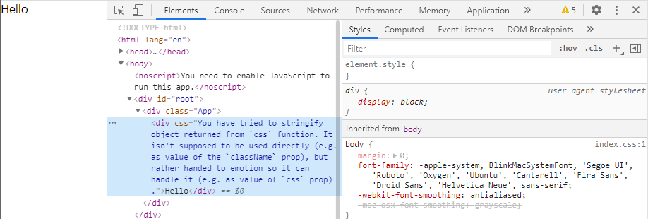
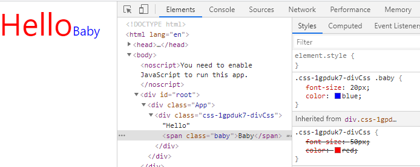

## 첫번째 시도

- CRA로 React App 생성

```bash
mkdir my-app
cd my-app

npx create-react-app .  # 현재 디렉토리에 설치
```

- emotion 관련 package install

```bash
npm i @emotion/react
```

인스톨 해서 바로 쓰면 적용될 줄 알았다. 하지만 전혀 되지 않았다.

```jsx
import { css } from '@emotion/react';

function App() {
  return (
    <div className="App">
      <div css={divCss}>
        Hello
      </div>
    </div>
  );
}

const divCss = css`
  font-size: 50px;
  color: red;
`;

export default App;
```



그래서 `@emotion/babel-plugin` 을 설치하고 `.babelrc` 파일을 생성하여 적용해 보았다.

```bash
npm i -D @emotion/babel-plugin
```

```bash
{
  "plugins": [
    "@emotion"
  ]
}
```

`npm start` 를 다시 해봤지만 똑같았다. (공식 문서를 따라서 하고 있는 중이다.)

`@emotion/babel-preset-css-prop` 도 설치하여 적용 해봤지만 되지 않았다.

공식문서에 `/** @jsx jsx */` 를 상단에 추가하라는 내용이 있어서 추가해봤지만 오히려 에러만 뜨고 이것저것 해봐도 해결이 되지 않았다.


## 두번째 시도

첫번째 시도 내용이 짧아보이지만 실제로는 이것저것 검색해보고 적용하느라 4시간쯤 삽질하였다.

그러던 중 `.babelrc`가 전혀 적용되지 않는다는 사실을 알게되었다.

일부러 `.babelrc` 내용을 막 틀리게 써도 에러도 전혀 뜨지 않더라.

`cra babelrc` 키워드로 검색해본 결과 `CRA` 로 생성한 리액트 앱에서는 `.babelrc` 가 적용되지 않는다는 사실을 알아냈다.

직접 적용하고 싶으면 `eject` 를 해줘야 한다.

`eject` 를 하지 않고 적용하는 방법도 있지만 오히려 패키지를 설치해야되서 더 번거로워 보였기에 패스.

그래서 `eject` 를 통해 적용에 성공하였다.

- CRA로 React App 생성
- git commit - 하지 않으면 `eject` 가 되지 않는다.

```bash
git init
git add .
git commit -m 'init'
```

`git commit` 을 하려면 user 정보를 설정해줘야 한다.

```bash
git config user.name ZungTa
```

- eject 진행

```bash
npm run eject
```

명령어를 치고 나오는 질문에서 y를 눌러준다.

`eject` 를 하고나면 `config` , `script` 폴더가 생기고 `package.json` 의 내용이 변경된다.

`package.json` 에 `babel` 내용이 추가된 것을 확인할 수 있다.

```json
...
"babel": {
  "presets": [
    "react-app"
  ]
}
...
```

- `@emotion/react`  패키지 설치

```bash
npm i @emotion/react
```

- `@emotion/babel-preset-css-prop` 패키지 설치

css prop 을 사용하려면 설치해서 적용해줘야 하는 것 같다.

[babel-preset-css-prop](https://emotion.sh/docs/@emotion/babel-preset-css-prop)

```bash
npm i @emotion/babel-preset-css-prop
```

- `babel` 설정 적용

`plugins` 는 추가 안해도 적용되긴 하지만 혹시 나중에 문제가 생길 수 있으니 넣어줬다.

```json
{
	...
	"babel": {
	  "presets": [
	    "react-app",
	    "@emotion/babel-preset-css-prop"
	  ],
		"plugins": [
	    "@emotion"
	  ]
	}
	...
}
```

- App.js 작성

```jsx
import { css } from '@emotion/react';

function App() {
  return (
    <div className="App">
      <div css={divCss}>
        Hello
        <span className="baby">
          Baby
        </span>
      </div>
    </div>
  );
}

const divCss = css`
  font-size: 50px;
  color: red;

  .baby {
    font-size: 20px;
    color: blue;
  }
`;

export default App;
```



적용이 잘 되었다.

위와 같이 하위 class까지도 적어서 적용할 수 있다.

미디어 쿼리나 `pseudo element` 도 할 수 있는 것 같은데 차차 알아봐야겠다.

## Typescript에 적용

이제 타입스크립트에 적용해보도록 하겠다.

[emotion typescript 공식문서](https://emotion.sh/docs/typescript)

- CRA로 Typescript React App 생성

```bash
mkdir my-app
cd my-app
npx create-react-app . --template typescript
```

- git commit

```bash
git init
git config user.name ZungTa
git add .
git commit -m 'init'
```

- eject

```bash
npm run eject
```

- install packages

```bash
npm i @emotion/react @emotion/babel-preset-css-prop
```

- babel config 적용

```json
{
	...
	"babel": {
	  "presets": [
	    "react-app",
	    "@emotion/babel-preset-css-prop"
	  ],
	  "plugins": [
	    "@emotion"
	  ]
	}
	...
}
```

- App.tsx 수정

```tsx
import { css } from '@emotion/react';

function App() {
  return (
    <div className="App">
      <div css={divCss}>
        Hello
      </div>
    </div>
  );
}

const divCss = css`
  font-size: 50px;
  color: red;
`;

export default App;
```

이렇게 적용하고 실행하면 되는 듯 하다가 에러가 뜬다.


공식문서에서 `/** @jsx jsx */` 를 최상단에 쓰면 babel plugin 없이 순수 타입스크립트로 `css prop` 이 되게 할 수 있다고 하는데 적용되지 않는다.

저 `/** @jsx jsx */` 는 쓰면 오류만 뜨니까 쓰지 않겠다.

이제 `tsconfig.json` 에 약간의 내용만 추가해주면 작동한다.

```json
{
	...
  "compilerOptions": {
    "jsxImportSource": "@emotion/react"
  }
	...
}
```

## 추가내용

```jsx
const divCss = css`
  font-size: 50px;
  color: red;
`;
```

이런 식으로 `backtick` 으로 함수를 사용할 때 vscode의 `vscode-styled-components` [확장](https://marketplace.visualstudio.com/items?itemName=jpoissonnier.vscode-styled-components)을 설치하면 더 편리하게 사용할 수 있다.